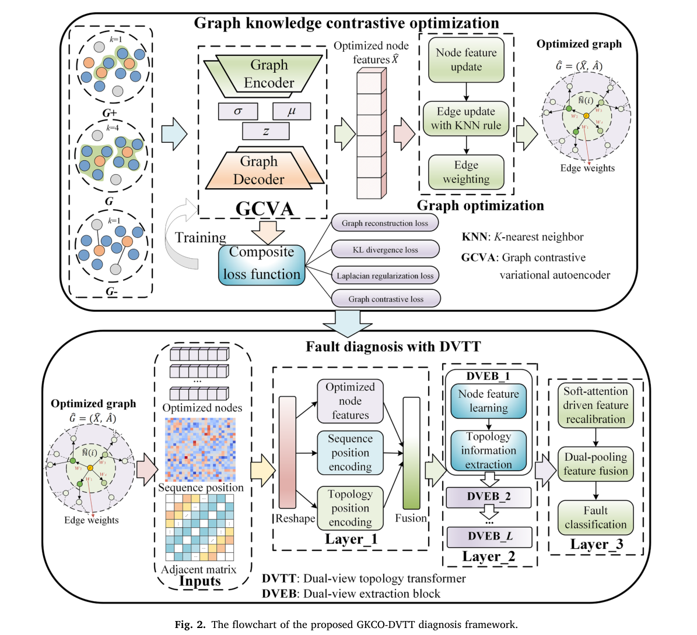

# GKCO-DVTT

**(https://doi.org/10.1016/j.ress.2026.112593)**, published in *Reliability Engineering & System Safety*, 272 (2026), 112593.

## Framework

<p align="center">
  
</p>

GKCO-DVTT consists of a plug-and-play **Graph Knowledge Contrastive Optimization (GKCO)** module for graph reliability enhancement and a **Dual-View Topological Transformer (DVTT)** for few-shot fault recognition.

## Requirements

```bash
pip install -r requirements.txt
```

The experiments in the paper were implemented with Python 3.12, PyTorch 2.8.0, and PyTorch Geometric 2.6.1.

## Dataset

The datasets used in the paper are not redistributed in this repository. Prepare the data locally as:

```text
data/<dataset_name>/
├── train_x.npy
├── train_y.npy
├── validation_x.npy
├── validation_y.npy
├── test_x.npy
└── test_y.npy
```

See [`data/README.md`](data/README.md) for the expected data format.

## Running

Axial-flow pump:

```bash
python scripts/run_pipeline.py --config configs/pump.yaml
```

BJTU-RAO:

```bash
python scripts/run_pipeline.py --config configs/bjtu_rao.yaml
```

Gaussian-noise evaluation can be enabled directly in the corresponding configuration file.

## Citation

If this work is useful for your research, please cite:

```bibtex
@article{zhang2026gkco,
  title   = {Plug-and-play graph reliability enhancement method for equipment state description under sparse information},
  author  = {Zhang, Xin and Liu, Jie and Huang, Ruyi and Hao, Jiancheng and Qiao, Zijian and Lu, Yanglong},
  journal = {Reliability Engineering \& System Safety},
  volume  = {272},
  pages   = {112593},
  year    = {2026},
  doi     = {10.1016/j.ress.2026.112593}
}
```
